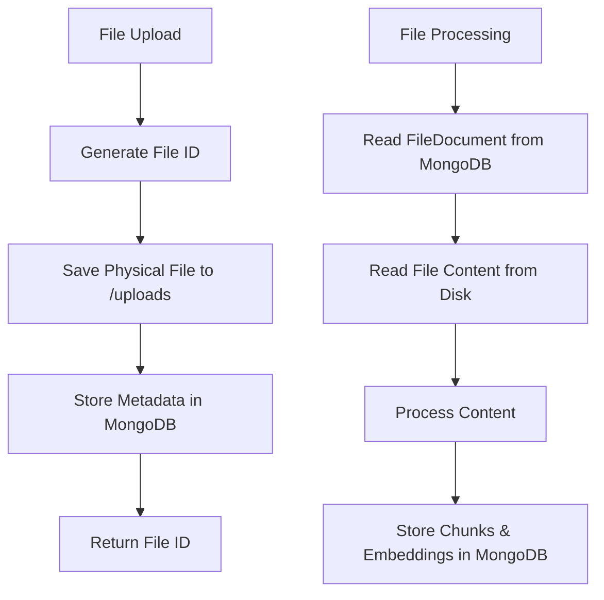

# ?? File Storage Implementation

## Overview
The LocalChat API implements an efficient file storage system that separates file content from metadata:

### Storage Strategy
- **Physical Files**: Stored in `/uploads` folder on the file system
- **Metadata**: Stored in MongoDB for fast querying and indexing
- **Content Access**: Files are read from disk when needed for processing

### Benefits
? **Reduced Database Size**: MongoDB only stores metadata, not file content
? **Better Performance**: Faster database queries and reduced memory usage
? **Scalability**: File system storage scales better than database BLOBs
? **Security**: Upload folder is excluded from source control
? **Flexibility**: Easy to implement CDN or cloud storage later

## File Storage Flow



## Directory Structure
```
LocalChatApi/
??? uploads/                    # Physical file storage (gitignored)
?   ??? ABC12345.pdf           # File ID + extension
?   ??? DEF67890.txt
?   ??? ...
??? Services/
?   ??? FileStorageService.cs  # Handles both FS and DB operations
??? Models/
    ??? ChatModels.cs           # FileDocument with FilePath
```

## FileDocument Schema (MongoDB)
```json
{
  "_id": "ObjectId",
  "fileId": "ABC12345",
  "sessionId": "session_123",
  "fileName": "document.pdf",
  "contentType": "application/pdf",
  "filePath": "/path/to/uploads/ABC12345.pdf",
  "fileSize": 1048576,
  "chunks": [...],
  "createdAt": "2024-01-01T00:00:00Z",
  "metadata": {...}
}
```

## Key Features

### ?? Security
- Upload folder excluded from git (`.gitignore`)
- File names use secure file IDs, not original names
- File type validation during upload

### ?? Performance
- Lazy loading: Content read only when needed
- Efficient MongoDB queries for metadata
- Reduced memory footprint

### ?? Maintenance
- Easy file cleanup with `DeleteFileAsync()`
- Automatic upload directory creation
- Comprehensive error handling

## Usage Examples

### Save File
```csharp
// Physical file saved to disk
var filePath = await _fileStorageService.SavePhysicalFileAsync(file, fileId);

// Metadata saved to MongoDB
var fileDoc = new FileDocument { FilePath = filePath, ... };
await _fileStorageService.SaveFileAsync(fileDoc);
```

### Read File Content
```csharp
// Read content from disk when needed
var content = await _fileStorageService.ReadFileContentAsync(fileId);
```

### Delete File
```csharp
// Removes both physical file and MongoDB record
await _fileStorageService.DeleteFileAsync(fileId);
```

## Configuration
No additional configuration required - the service automatically:
- Creates `/uploads` directory if missing
- Manages file naming and organization
- Handles cleanup on deletion

This implementation provides a robust, scalable foundation for file storage that can easily be extended to support cloud storage providers like AWS S3 or Azure Blob Storage in the future.